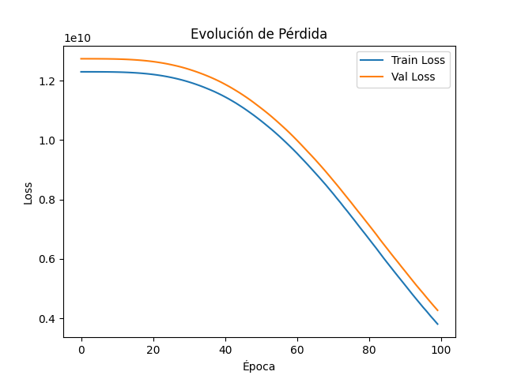
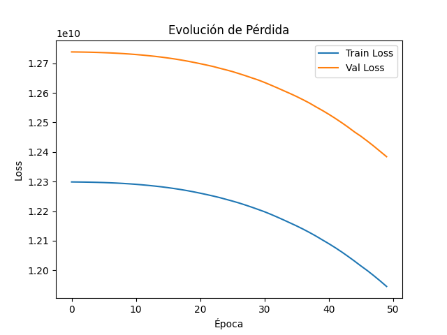
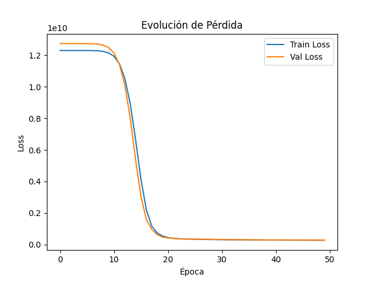
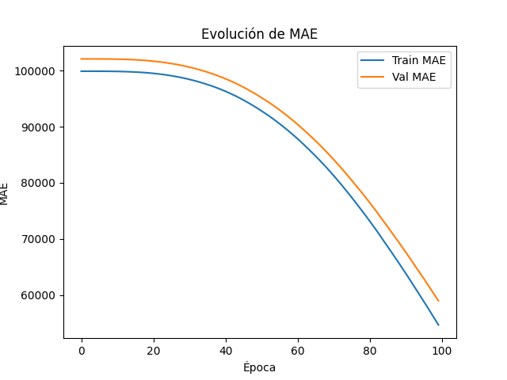
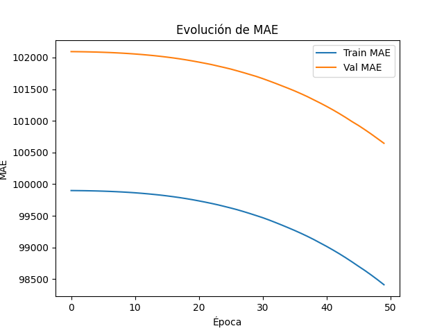
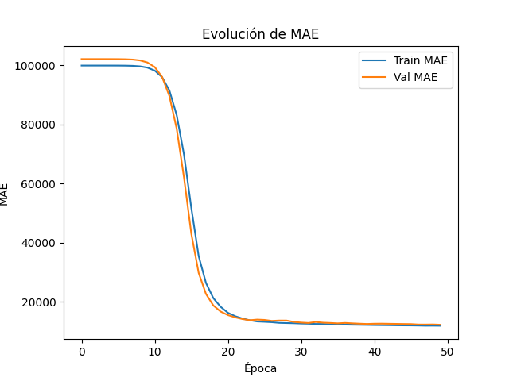
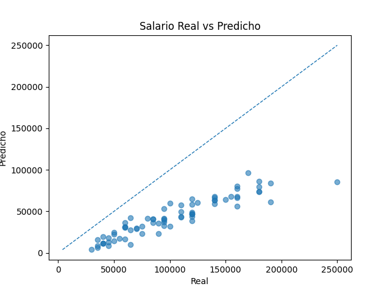
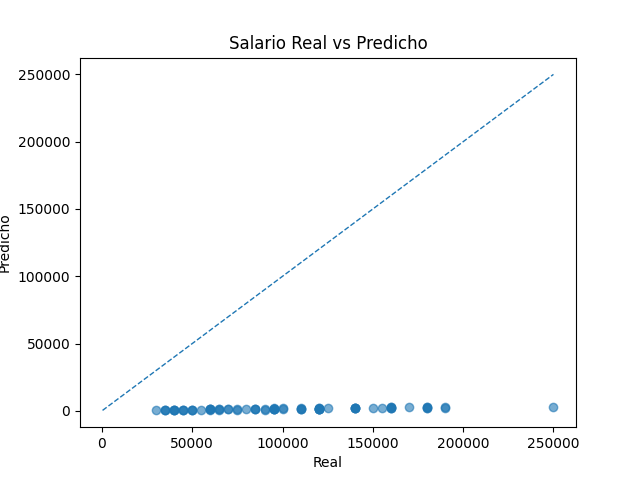
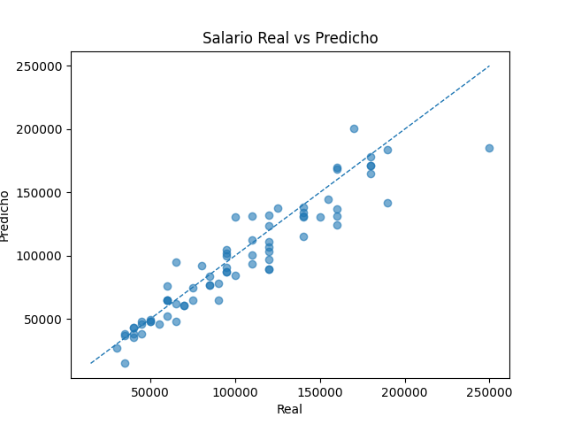

# 💸 SalaryPrediction

## 📊 Resumen Modelos Predictivos

En este reporte se comparan **cuatro configuraciones** de MLP para regresión salarial, variando optimizador, número de capas ocultas, neuronas, learning rate, épocas y batch size. Para cada modelo:

- Entrenamiento sobre 368 registros históricos (80/20 split)
- Curvas de pérdida (MSE) y MAE
- Cálculo de RMSE y MAPE sobre validación
- Predicción de salarios para 5 empleados nuevos y cuantificación del error porcentual

---

## 📝 Enunciado del Problema

La empresa **TechNova Solutions** necesita estimar salarios justos para cinco nuevos ingresos, basándose en datos históricos de empleados actuales y anteriores. Variables consideradas:

- **Edad** (`Age`)
- **Género** (`Gender`)
- **Nivel educativo** (`Education Level`)
- **Puesto** (`Job Title`)
- **Años de experiencia** (`Years of Experience`)
- **Salario** (`Salary`)

Se plantea un modelo de regresión con redes neuronales MLP que reciba las características, procese y normalice los datos, y arroje una predicción continua de salario.

---

## ⚙️ Código Utilizado

<details>
<summary><b>data_preprocessing.py</b></summary>

- Carga CSV/XLSX  
- OneHotEncoding de variables categóricas  
- StandardScaler de variables numéricas  
- División 80/20 en train/val  

```python
def preprocess(X, fit=True, encoder_path=None, scaler_path=None):
    cat_cols = ['Gender', 'Education Level', 'Job Title']
    num_cols = ['Age', 'Years of Experience']
    # ...encoding y escalado...
    return pd.concat([df_num, df_cat], axis=1)
```
</details>

<details>
<summary><b>model.py</b></summary>

- MLP con `hidden_layers` capas ReLU + salida lineal  
- Compilación con `loss='mse'` y `metrics=['mae']`  

```python
def build_model(input_dim, hidden_layers, neurons, learning_rate, opt_name):
    # ...definición de modelo secuencial...
    model.compile(
        optimizer=opts[opt_name],
        loss='mse',
        metrics=['mae']
    )
    return model
```
</details>

<details>
<summary><b>train.py</b></summary>

- Argumentos CLI para hiperparámetros  
- Callbacks: EarlyStopping (val_loss), ModelCheckpoint  
- Guarda modelo en `models/{model_name}.h5`  
- Grafica pérdida y MAE en `results/plots/{model_name}/`  
- Exporta CSV de hiperparámetros y de métricas (RMSE, MAPE) en `results/tables/{model_name}/`  

```python
def train_model(model, X_train, y_train, X_val, y_val, epochs, batch_size, model_save_path):
    checkpoint = ModelCheckpoint(
        model_save_path,
        monitor='val_loss',
        save_best_only=True,
        mode='min'
    )
    earlystop = EarlyStopping(
        monitor='val_loss',
        patience=5,
        restore_best_weights=True
    )
    history = model.fit(
        X_train, y_train,
        validation_data=(X_val, y_val),
        epochs=epochs,
        batch_size=batch_size,
        callbacks=[checkpoint, earlystop]
    )
    return history
```
</details>

<details>
<summary><b>predict.py</b></summary>

- Argumento `--model` para elegir `.h5`  
- Carga `prediccion.xlsx`, aplica mismo preprocesamiento  
- Guarda predicciones y `% error` en `results/tables/{model_name}/predictions_errors.csv`  

```python
if __name__ == '__main__':
    # ...argumentos...
    model = load_model(args.model)
    preds = model.predict(Xp).flatten()
    errors_pct = (preds - desired) / desired * 100
    df_out = pd.DataFrame({
        'predicted_salary': preds,
        'desired_salary':   desired,
        'error_%':          errors_pct
    })
    df_out.to_csv(out_path, index=False)
```
</details>

---

## 🏆 Resultados

### Modelos y Hiperparámetros

| Modelo              | Optimizador | Capas | Neuronas | LR     | Épocas | Batch |
|---------------------|-------------|-------|----------|--------|--------|-------|
| Baseline            | Adam        | 2     | 64       | 0.001  | 100    | 32    |
| Profundo            | SGD         | 3     | 128      | 0.01   | 100    | 16    |
| RMSprop Rápido      | RMSprop     | 2     | 64       | 0.001  | 50     | 32    |
| Adadelta Ligero     | Adadelta    | 1     | 32       | 1.0    | 50     | 32    |

---

### 1️⃣ Curvas de Pérdida (MSE)

#### Adam


#### RMSprop


#### Adadelta


---

### 2️⃣ Curvas de MAE

#### Adam
  

#### RMSprop


#### Adadelta


---

### 3️⃣ Comparación Real vs Predicho

#### Adam
  

#### RMSprop
 

#### Adadelta


---

### 4️⃣ Métricas (RMSE, MAPE)

| Modelo                | RMSE           | MAPE (%)         |
|-----------------------|----------------|------------------|
| adam_h2_n64_lr001     | 65 362.74      | 58.95            |
| rmsprop_h2_n64_lr001  | 111 285.15     | 98.57            |
| adadelta_h1_n32_1.0   | 16 866.73      | 12.10            |

---

## 👤 Predicción Nuevos Empleados

### adam_h2_n64_lr001

| predicted_salary | desired_salary | error_%   |
|------------------|---------------|-----------|
| 77530.91         | 150000        | -48.31    |
| 22272.738        | 40000         | -44.32    |
| 73759.48         | 150000        | -50.83    |
| 85534.65         | 160000        | -46.54    |
| 43173.848        | 90000         | -52.03    |

### rmsprop_h2_n64_lr001

| predicted_salary | desired_salary | error_%   |
|------------------|---------------|-----------|
| 2163.5764        | 150000        | -98.56    |
| 716.99615        | 40000         | -98.21    |
| 2016.3434        | 150000        | -98.66    |
| 2308.1353        | 160000        | -98.56    |
| 1246.7723        | 90000         | -98.61    |

### adadelta_h1_n32_1.0

| predicted_salary | desired_salary | error_%   |
|------------------|---------------|-----------|
| 128847.44        | 150000        | -14.10    |
| 38411.316        | 40000         | -3.97     |
| 127712.83        | 150000        | -14.86    |
| 151920.14        | 160000        | -5.05     |
| 83957.53         | 90000         | -6.71     |

---

## 💡 Conclusiones y Observaciones

- **Rendimiento:** El modelo con _Adadelta_ y configuración ligera obtuvo el menor MAPE (~12.1 %), seguido de _Adam_.  
- **Profundidad:** Más capas y neuronas mejoran la capacidad pero requieren más datos/épocas para converger.
- **Elección de LR:** Tasas muy altas (Adadelta 1.0) pueden ser inestables (MAPE alto).
- **Aplicabilidad:** La subestimación sistemática sugiere añadir más datos o features (p. ej. ubicación, desempeño).
- **Limitación:** No se pudo utilizar el optimizador **SGD** debido a que el entrenamiento colapsaba frecuentemente (divergencia o pérdida infinita).

---

## 📚 Referencias

1. Chollet, F. et al. _Deep Learning with Python_. Manning, 2017.  
2. Géron, A. _Hands-On Machine Learning with Scikit-Learn, Keras, and TensorFlow_. O’Reilly, 2019.  
3. TensorFlow API – https://www.tensorflow.org/api_docs  
4. Scikit‑Learn Preprocessing – https://scikit-learn.org/stable/modules/preprocessing.html  
5. Oliva, D. “Tarea 2 – Modelos Predictivos,” Seminario IA II, CUCEI, 2025.

---

## 🚀 Getting Started

Sigue estos pasos para ejecutar el proyecto desde cero:

### 1. Clonar el repositorio

```bash
git clone https://github.com/Tiobilito/SalaryPrediction.git
cd SalaryPrediction
```

### 2. Crear entorno virtual (usando conda)

```bash
conda env create -f environment.yml
conda activate d:\Repositorios\SalaryPrediction\.conda
```

### 3. Preparar los datos

Coloca tu archivo de **entrenamiento** `prediccion.xlsx` en la carpeta `DATASET-SALARY/`.

El archivo `salarios.csv` (ya incluido de ejemplo) se utiliza para realizar las **predicciones**.

### 4. Entrenar un modelo

```bash
python main.py train --optimizer Adam --epochs 100 --batch_size 32 --learning_rate 0.001 --hidden_layers 2 --neurons 64
```

Puedes ajustar los hiperparámetros según lo desees.

> **Nota:**  
> Después de entrenar el modelo, se exportan automáticamente las **gráficas** (curvas de pérdida, MAE, real vs predicho) en `results/plots/{model_name}/` y las **tablas** de métricas e hiperparámetros en `results/tables/{model_name}/`.

### 5. Realizar predicciones

Coloca tu archivo `salarios.csv` en la carpeta `DATASET-SALARY/` (debe tener las mismas columnas que el set de entrenamiento, excepto la columna objetivo).

Luego ejecuta:

```bash
python main.py predict --model models/adam_h2_n64_lr001.h5
```

Los resultados se guardarán en `results/tables/{model_name}/predictions_errors.csv`.
